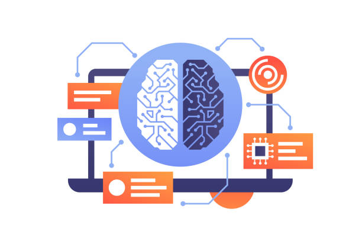

# About Me - Data Science and Machine Learning Enthusiast

Hello, and welcome to my personal information page! My name is Akshat, and I am passionate about Data Science and Machine Learning. This `readme.md` serves as a brief introduction to who I am and my interests in the field.

## Table of Contents

- [Introduction](#introduction)
- [My Interests](#my-interests)
- [Skills](#skills)
- [Connect with Me](#connect-with-me)

## Introduction

I am an incoming MIS CSE student at the University of Pennsylvania with a strong background in Computer Scicence in general and Data Science & Machine Learning in particular. I have always been fascinated by the power of data and how it can be harnessed to gain insights, make predictions, and solve complex problems.

## My Interests

My primary interests revolve around:

- **Data Analysis:** I enjoy exploring and analyzing datasets to uncover hidden patterns and trends. Data visualization is one of my favorite tools to communicate insights effectively.

- **Machine Learning:** I am passionate about developing machine learning models that can make predictions, classify data, and automate decision-making processes.

- **Deep Learning:** I am intrigued by the capabilities of deep neural networks and their applications in computer vision, natural language processing, and more.

- **Data Engineering:** Building robust data pipelines and architectures to collect, store, and process data is an area I find challenging and rewarding.

## Skills

Here are some of the skills and technologies I have experience with:

- **Programming Languages:** Python, R, SQL, C/C++, Java, C#
- **Data Analysis Tools:** Pandas, NumPy, SciPy
- **Machine Learning Libraries:** Scikit-Learn, TensorFlow, Keras, PyTorch
- **Data Visualization:** Matplotlib, Seaborn, ggplot2
- **Database Management:** SQL
- **Version Control:** Git, GitHub

## Connect with Me

I am always eager to connect with fellow data enthusiasts, researchers, and professionals. You can find me on the following platforms:

- [LinkedIn](https://www.linkedin.com/in/akshat-bokdia-68b29a227/)
- [Twitter](https://twitter.com/akshat_bokdia)
- [Google Scholar](https://scholar.google.com/citations?hl=en&authuser=1&user=I0g9fTUAAAAJ)
- [Email](mailto:akshatbokdia1411@gmail.com) 

Feel free to reach out to me if you'd like to discuss data science or machine learning, collaborate on projects, or just have a chat about our shared interests!

Thank you for visiting my personal information page, and I look forward to connecting with you!
